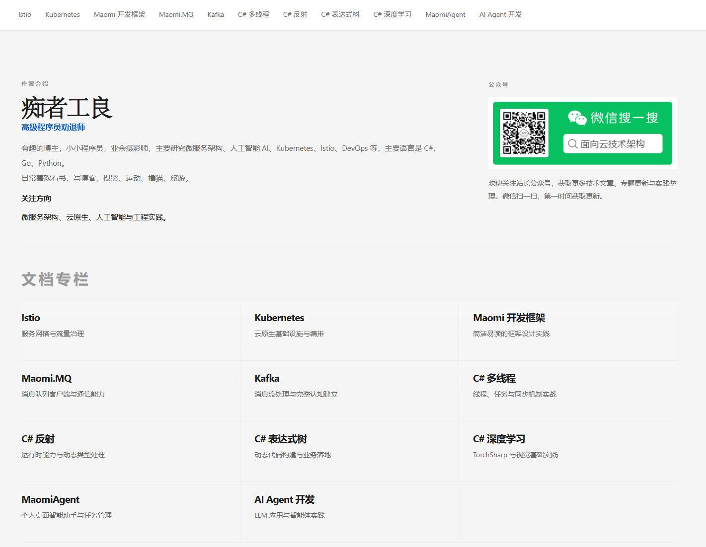

### whuanle | 痴者工良

有趣的博主，小小程序员，业余摄影师，主要研究微服务架构、人工智能 AI、Kubernetes、Istio、DevOps 等，主要语言是 C#、Go、Python。
日常喜欢看书、写博客、摄影、运动、撸猫、旅游。

**关注方向**：微服务架构、云原生、人工智能与工程实践。

 <a href="https://www.whuanle.cn">https://www.whuanle.cn</a>

 <a href="https://docs.whuanle.cn">https://docs.whuanle.cn</a>

 <a href="https://www.whuanle.cn/">https://github.com/whuanle</a>

#### Languages & Tools:

  

  

  

  

### Microsoft MVP

[https://mvp.microsoft.com/zh-CN/MVP/profile/9f6313d9-0d07-ec11-b6e6-000d3a57952c](https://mvp.microsoft.com/zh-CN/MVP/profile/9f6313d9-0d07-ec11-b6e6-000d3a57952c)

### Ebook or course:

[https://docs.whuanle.cn](https://docs.whuanle.cn)

